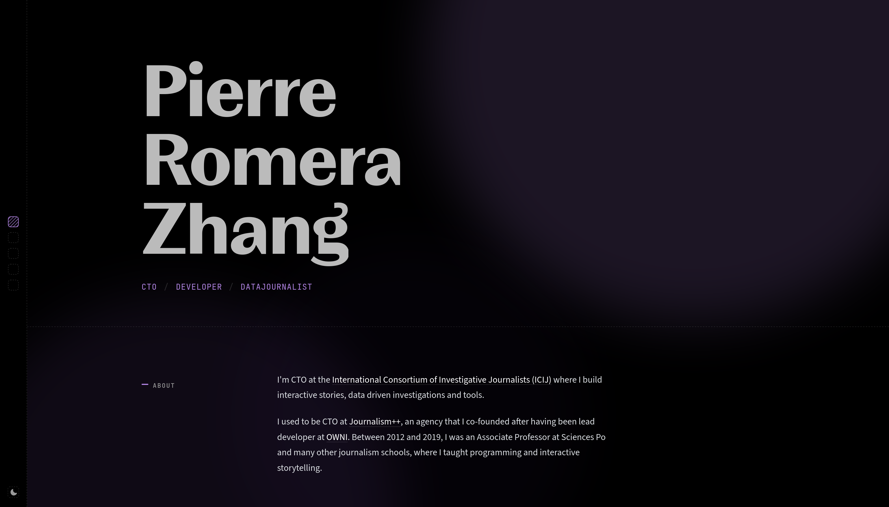

# v3.pirhoo.com



## Installation

Make sure you have [Node.js](https://nodejs.org/) and [Yarn](https://yarnpkg.com/) installed, then run:

```bash
yarn install
```

## Usage

```bash
yarn dev       # Start the development server with hot-reload
yarn build     # Build for production
yarn preview   # Preview the production build locally
yarn lint      # Lint and fix files
yarn test      # Run tests with Vitest
yarn csv       # Run the data pipeline (see below)
```

## Scripts

### `scripts/csv.mjs`

Data pipeline script that processes CSV source files from `/data/` into JSON assets consumed by the app. Run it with `yarn csv`. The pipeline executes the following steps in order:

1. **Trainings** — Aggregates training data (hours, countries, customers) from `data/trainings.csv`
2. **Commits** — Scans sibling git repositories for commit history and writes `data/commits.csv`
3. **Count** — Generates daily and monthly commit counts for the activity visualization
4. **Investigations** — Converts `data/investigations.csv` to JSON
5. **Projects** — Converts `data/projects.csv` to JSON with generated thumbnail paths
6. **Awards** — Aggregates award statistics from `data/awards.csv`
7. **OSS** — Processes open-source contributions from `data/oss.csv`
8. **Sizes** — Reads thumbnail dimensions and writes them into the projects JSON
9. **Colors** — Extracts dominant colors from project thumbnails using node-vibrant

## License

This project is licensed under the MIT License. See [LICENSE.md](LICENSE.md) for details.
